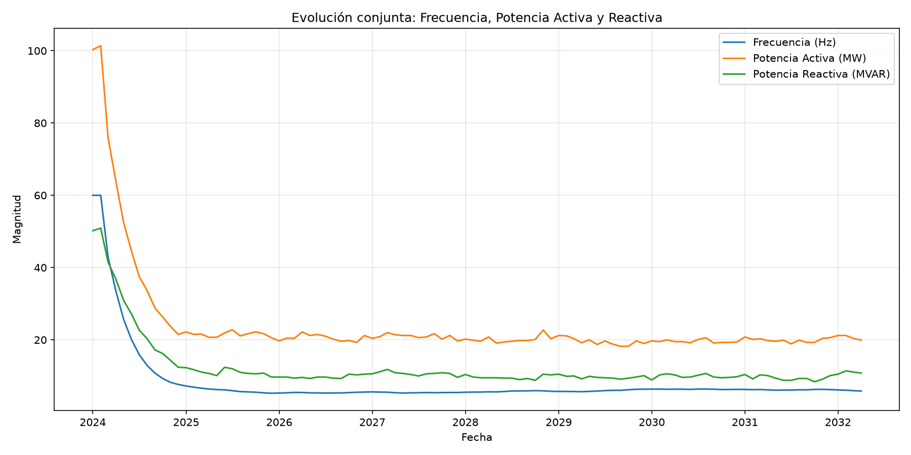
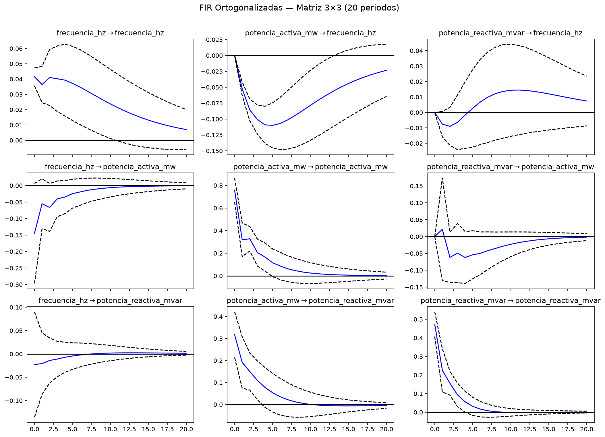

# Examen de Procesos Estocásticos Multivariados — Resolución Integral

**Curso:** Procesos Estocásticos 2026-1 | **UPG FIEE**  
**Fecha de resolución:** 17 de junio de 2026  
**Proyecto:** ee05-procesos-estocasticos

---

## Parte Teórica (60 %)

---

### Pregunta 1 (15 %) — Función Impulso Respuesta (FIR) en modelos VAR

#### a) Definición de la FIR en el contexto VAR

Sea un proceso estocástico multivariado estacionario $\{X_t\}$ con $X_t \in \mathbb{R}^K$, representado por un modelo Vectorial Autorregresivo de orden $p$, VAR($p$):

$$X_t = c + \sum_{i=1}^{p} A_i X_{t-i} + \varepsilon_t, \quad \varepsilon_t \sim WN(0, \Sigma)$$

Mediante la representación de Media Móvil (VMA($\infty$)), el proceso puede reescribirse como:

$$X_t = \mu + \sum_{h=0}^{\infty} \Psi_h \varepsilon_{t-h}$$

donde $\Psi_0 = I_K$ y las matrices $\Psi_h$ se obtienen recursivamente a partir de los coeficientes $A_i$.

La **Función Impulso Respuesta (FIR)**, también denominada **Impulse Response Function (IRF)**, es la secuencia de matrices $\{\Psi_h\}_{h=0}^{\infty}$ que cuantifica la respuesta dinámica del sistema ante un shock unitario (o de una desviación estándar) en una componente del vector de innovaciones $\varepsilon_t$ en el instante $t$, evaluada $h$ periodos después.

Formalmente, el elemento $(i,k)$ de $\Psi_h$ mide cuánto cambia la variable $i$ en el periodo $t+h$ ante un incremento de una unidad en el shock $\varepsilon_{k,t}$:

$$\frac{\partial X_{i,t+h}}{\partial \varepsilon_{k,t}} = \Psi_h(i,k)$$

La FIR permite caracterizar la transmisión de perturbaciones entre variables, la persistencia de los shocks, la velocidad de ajuste del sistema y la identificación de relaciones dinámicas de causa-efecto en el sentido de Granger.

#### b) Interpretación física en un sistema de potencia

En el sistema de potencia con $X_t = [f_t,\, P_t,\, Q_t]'$, donde $f_t$ es la frecuencia (Hz), $P_t$ la potencia activa (MW) y $Q_t$ la potencia reactiva (MVAR), la ecuación:

$$\frac{\partial X_{t+h}}{\partial \varepsilon_{k,t}} = \Psi_h$$

significa lo siguiente para cada shock $k$:

| Shock ($k$) | Interpretación física de $\Psi_h(i,k)$ |
|---|---|
| $k=1$ (frecuencia) | Respuesta de $f$, $P$ y $Q$ tras una perturbación transitoria en el equilibrio dinámico de frecuencia (p. ej., desbalance generación-carga). |
| $k=2$ (potencia activa) | Efecto de un incremento súbito en la potencia activa inyectada o absorbida sobre la frecuencia y las demás variables en los $h$ meses siguientes. |
| $k=3$ (potencia reactiva) | Efecto de una perturbación en el soporte de tensión (potencia reactiva) sobre el resto del sistema. |

**Ejemplo concreto:** Si $\Psi_h(1,2) < 0$ para $h = 1, 2, \ldots$, un shock positivo en potencia activa (aumento de generación neta) provoca una **caída en la frecuencia** en los periodos subsiguientes, consistente con la dinámica del swing equation en régimen transitorio: un exceso de potencia inyectada acelera los rotores y eleva la frecuencia momentáneamente, pero la respuesta dinámica del sistema (incluyendo regulación primaria y secundaria) puede modificar esa trayectoria en el horizonte de $h$ periodos.

La FIR transforma los coeficientes del VAR en magnitudes con unidad física interpretable para el operador del sistema eléctrico.

#### c) Necesidad de la descomposición de Cholesky ($\Sigma = PP'$)

Los residuos $\varepsilon_t$ del VAR tienen matriz de covarianza $\Sigma$ que, en general, **no es diagonal**. Esto implica que los shocks de distintas variables están **contemporáneamente correlacionados**: en un mismo instante $t$, una perturbación en la frecuencia y en la potencia activa ocurren simultáneamente y no son observables de forma separada.

La FIR no ortogonalizada $\Psi_h$ responde a shocks correlacionados, lo que impide aislar el efecto de una sola variable y conduce a interpretaciones ambiguas.

La descomposición de Cholesky $\Sigma = PP'$, con $P$ triangular inferior, define **innovaciones ortogonalizadas**:

$$u_t = P^{-1}\varepsilon_t, \quad \mathbb{E}[u_t u_t'] = I_K$$

Las **FIR ortogonalizadas** se calculan como:

$$\Theta_h = \Psi_h P$$

**Razones de su uso obligatorio:**

1. **Identificación estructural:** Aísla el efecto de un shock en una variable sin contaminación contemporánea de las demás (según el orden de triangularización).
2. **Interpretabilidad causal:** Permite asignar un sentido direccional a la propagación (p. ej., "shock en $P_t$ → respuesta en $f_t$").
3. **Normalización:** Los shocks ortogonalizados tienen varianza unitaria, facilitando comparaciones entre variables de distinta escala (Hz vs. MW vs. MVAR).

**Advertencia:** El orden de las variables en la triangularización de Cholesky es una ** restricción de identificación**. En sistemas de potencia, el ordenamiento típico $[f, P, Q]$ asume que la frecuencia responde instantáneamente a los shocks propios pero no a los de $P$ y $Q$ en el mismo periodo, lo cual es coherente con la jerarquía temporal del control de frecuencia.

---

### Pregunta 2 (15 %) — Cointegración en Sistemas de Potencia

#### a) Concepto de cointegración

Un vector de series temporales $X_t = (X_{1t}, \ldots, X_{Kt})'$ se dice que es **integrado de orden uno**, denotado $I(1)$, si cada componente $X_{it}$ requiere una diferencia primera para alcanzar estacionariedad:

$$\Delta X_{it} \sim I(0) \quad \forall i$$

Es decir, cada variable individual presenta una raíz unitaria (comportamiento tipo random walk o tendencia estocástica).

Sin embargo, en sistemas económicos y físicos reales, las variables individuales pueden ser no estacionarias pero estar **ligadas por relaciones de equilibrio de largo plazo**. Se dice que el vector $X_t$ es **cointegrado**, denotado $X_t \sim CI(1,1)$, si existe al menos un vector $\beta \in \mathbb{R}^K$ tal que:

$$\beta' X_t \sim I(0)$$

Es decir, existe una **combinación lineal** de las variables no estacionarias que es estacionaria.

**Interpretación:** Aunque cada variable "deriva" individualmente, el sistema como conjunto revierte hacia una relación de equilibrio de largo plazo. La desviación $\beta' X_t$ representa el **error de equilibrio** o desbalance, que es transitorio y tiende a corregirse.

En notación del modelo de corrección de errores (VECM):

$$\Delta X_t = \Pi X_{t-1} + \sum_{i=1}^{p-1} \Gamma_i \Delta X_{t-i} + \varepsilon_t$$

donde $\Pi = \alpha \beta'$ con $\text{rank}(\Pi) = r$ indicando el número de relaciones de cointegración.

#### b) Aplicación en planificación de expansión de red (10–20 años)

En la planificación estratégica de la red de transmisión eléctrica a largo plazo, la cointegración permite modelar relaciones de equilibrio entre variables macro del sector eléctrico que, individualmente, presentan tendencias (crecimiento de demanda, expansión de capacidad instalada), pero que mantienen una relación estable en el largo plazo.

**Variables involucradas:**

| Variable | Descripción |
|---|---|
| $D_t$ | Demanda máxima de energía (MW) |
| $G_t$ | Capacidad instalada de generación (MW) |
| $L_t$ | Longitud o capacidad de líneas de transmisión (km o MVA) |
| $I_t$ | Inversión acumulada en infraestructura (USD) |

**Relación de cointegración esperada:**

$$\beta' [D_t,\, G_t,\, L_t,\, I_t]' \sim I(0)$$

Por ejemplo: $G_t - \alpha D_t - \gamma L_t \sim I(0)$, expresando que la capacidad de generación y transmisión debe crecer de forma coherente con la demanda para mantener el equilibrio oferta-demanda.

**Utilidad para la planificación:**

- **Proyección de largo plazo:** El VECM genera pronósticos que respetan la relación de equilibrio, evitando escenarios donde la generación crece indefinidamente sin respaldo en transmisión.
- **Detección de sub-inversión:** Si $\beta' X_t$ se desvía persistentemente del equilibrio, indica necesidad de expansión de la red.
- **Evaluación de escenarios:** Permite simular el impacto de políticas energéticas (transición renovable, electrificación) sobre el equilibrio generación-transmisión-demanda.

En plataformas como **FactoryTalk Analytics** e **InnovationSuite**, los modelos VECM/cointegración se emplean para análisis de tendencias de activos y planificación de capacidad — este es un algoritmo con **alto valor industrial**.

#### c) Pérdida de cointegración en monitoreo de frecuencia entre nodos distantes

En una red interconectada, las frecuencias de dos nodos distantes $f_{A,t}$ y $f_{B,t}$ son individualmente $I(1)$ (presentan deriva estocástica por desbalances locales), pero en condiciones normales de operación están **cointegradas**:

$$f_{A,t} - f_{B,t} \sim I(0)$$

Esta relación refleja el acoplamiento eléctrico del sistema interconectado: ambos nodos comparten la misma dinámica de frecuencia del sistema síncrono.

**Interpretación de la pérdida de cointegración:**

1. **Desacoplamiento físico o eléctrico:** Una falla en líneas de interconexión, apertura de seccionadores o isla operativa ha roto el equilibrio de frecuencia entre los nodos. El spread $f_{A,t} - f_{B,t}$ deja de ser estacionario y diverge.

2. **Pérdida de sincronismo:** Los dos nodos operan como sistemas independientes con dinámicas de frecuencia descorrelacionadas, indicando posible **islamiento involuntario** o transición hacia operación en isla.

3. **Alerta operativa crítica:** En un contexto SCADA (referente: **FactoryTalk View**, **Ignition**), la ruptura de cointegración entre frecuencias de nodos debe generar una **alarma de alta prioridad**, ya que precede o acompaña eventos de inestabilidad grave (cascadas, blackouts parciales).

4. **Acción correctiva:** El operador debe verificar el estado de las interconexiones, la generación local en cada área y activar esquemas de control de frecuencia load-shedding si el desbalance persiste.

---

### Pregunta 3 (15 %) — Modelo Vectorial Autorregresivo (VAR)

#### a) Ecuación general del VAR($p$)

Para un vector $Y_t$ de dimensión $K \times 1$:

$$Y_t = c + A_1 Y_{t-1} + A_2 Y_{t-2} + \cdots + A_p Y_{t-p} + \varepsilon_t$$

**Definición de componentes:**

| Componente | Dimensión | Descripción |
|---|---|---|
| $Y_t$ | $K \times 1$ | Vector de variables endógenas en el instante $t$. |
| $c$ | $K \times 1$ | Vector de constantes (interceptos de cada ecuación). |
| $A_i$ | $K \times K$ | Matrices de coeficientes del rezago $i$; el elemento $A_i(j,k)$ mide el efecto de $Y_{k,t-i}$ sobre $Y_{j,t}$. |
| $p$ | escalar | Orden del modelo (número máximo de rezagos). |
| $\varepsilon_t$ | $K \times 1$ | Vector de innovaciones (ruido blanco): $\mathbb{E}[\varepsilon_t]=0$, $\mathbb{E}[\varepsilon_t \varepsilon_t'] = \Sigma$, $\mathbb{E}[\varepsilon_t \varepsilon_s']=0$ para $t \neq s$. |

En forma expandida, la ecuación $j$-ésima del sistema es:

$$Y_{j,t} = c_j + \sum_{i=1}^{p} \sum_{k=1}^{K} A_i(j,k) \cdot Y_{k,t-i} + \varepsilon_{j,t}$$

#### b) VAR(1) para Temperatura, Presión y Caudal

Con $Y_t = [T_t,\, P_t,\, C_t]'$ y $p=1$:

$$
\begin{bmatrix} T_t \\ P_t \\ C_t \end{bmatrix}
=
\begin{bmatrix} c_1 \\ c_2 \\ c_3 \end{bmatrix}
+
\begin{bmatrix}
a_{11} & a_{12} & a_{13} \\
a_{21} & a_{22} & a_{23} \\
a_{31} & a_{32} & a_{33}
\end{bmatrix}
\begin{bmatrix} T_{t-1} \\ P_{t-1} \\ C_{t-1} \end{bmatrix}
+
\begin{bmatrix} \varepsilon_{1t} \\ \varepsilon_{2t} \\ \varepsilon_{3t} \end{bmatrix}
$$

En forma escalar:

$$T_t = c_1 + a_{11}T_{t-1} + a_{12}P_{t-1} + a_{13}C_{t-1} + \varepsilon_{1t}$$

$$P_t = c_2 + a_{21}T_{t-1} + a_{22}P_{t-1} + a_{23}C_{t-1} + \varepsilon_{2t}$$

$$C_t = c_3 + a_{31}T_{t-1} + a_{32}P_{t-1} + a_{33}C_{t-1} + \varepsilon_{3t}$$

**Significado de $A_1(2,1) = a_{21} = 0$:**

El coeficiente $A_1(2,1)$ es el elemento fila 2, columna 1 de $A_1$, es decir, el efecto de $T_{t-1}$ (temperatura rezagada) sobre $P_t$ (presión actual).

Si $a_{21} = 0$, la ecuación de presión se reduce a:

$$P_t = c_2 + a_{22}P_{t-1} + a_{23}C_{t-1} + \varepsilon_{2t}$$

**Interpretación industrial:** La presión actual **no depende directamente** de la temperatura pasada, una vez controlado por la presión y el caudal pasados. Esto implica:

- **Restricción estructural:** No existe acoplamiento dinámico directo temperatura → presión con rezago de un periodo.
- **Implicación para control automático:** El lazo de control de presión puede diseñarse sin considerar la temperatura como variable explicativa directa (aunque puede haber efectos indirectos vía el caudal, si $a_{23} \neq 0$).
- **Test de hipótesis:** En la estimación, $a_{21}=0$ puede imponerse como restricción para un modelo más parsimonioso (VAR restringido).

#### c) Criterios de selección del orden óptimo $p$

| Criterio | Fórmula (conceptual) | Principio que balancea |
|---|---|---|
| **AIC** (Akaike Information Criterion) | $\text{AIC}(p) = \ln|\hat{\Sigma}_p| + \frac{2}{T}K^2 p$ | Bondad de ajuste vs. complejidad; penalización **moderada** por parámetros adicionales. Tiende a seleccionar modelos con más rezagos. |
| **BIC/SIC** (Bayesian/Schwarz Information Criterion) | $\text{BIC}(p) = \ln|\hat{\Sigma}_p| + \frac{\ln T}{T}K^2 p$ | Bondad de ajuste vs. complejidad; penalización **más estricta** que AIC (crece con $\ln T$). Tiende a seleccionar modelos más parsimoniosos. |
| **HQIC** (Hannan-Quinn) | $\text{HQIC}(p) = \ln|\hat{\Sigma}_p| + \frac{2\ln(\ln T)}{T}K^2 p$ | Intermedio entre AIC y BIC; penalización creciente con el tamaño muestral. |
| **FPE** (Final Prediction Error) | $\text{FPE}(p) = \left(\frac{T+Kp+1}{T-Kp-1}\right)^K |\hat{\Sigma}_p|$ | Minimiza el error de predicción fuera de muestra; balance entre ajuste in-sample y capacidad predictiva. |

**Principio general:** Todos los criterios de información minimizan una función que combina el logaritmo del determinante de la matriz de covarianza de residuos ($\ln|\hat{\Sigma}_p|$, proxy de bondad de ajuste) con un término de penalización creciente en $p$ (complejidad del modelo). El orden óptimo $\hat{p}$ es aquel que minimiza el criterio elegido.

---

### Pregunta 4 (15 %) — Aplicaciones de VAR a Sistemas de Potencia

#### a) Pronóstico conjunto del despacho económico

Un modelo VAR puede pronosticar conjuntamente las variables del despacho económico en un sistema con generación hidroeléctrica, eólica y demanda, capturando las **interdependencias dinámicas** entre fuentes de generación y consumo.

**Variables del VAR:**

$$Y_t = [P_{\text{hidro},t},\; P_{\text{eolica},t},\; D_t,\; P_{\text{spot},t}]'$$

donde $P_{\text{hidro},t}$ es la generación hidroeléctrica, $P_{\text{eolica},t}$ la generación eólica, $D_t$ la demanda y $P_{\text{spot},t}$ el precio spot de energía.

**Procedimiento:**

1. **Estimación:** Se estima VAR($\hat{p}$) con datos históricos horarios o diarios de generación y demanda.
2. **Pronóstico iterativo:** Dado el vector de rezagos observados, se calcula $\hat{Y}_{T+h|T} = \hat{c} + \sum_{i=1}^{p} \hat{A}_i \hat{Y}_{T+h-i|T}$ para $h = 1, 2, \ldots, H$.
3. **Despacho económico:** Los pronósticos de $D_t$, $P_{\text{eolica},t}$ (altamente variable) y $P_{\text{hidro},t}$ (limitada por embalses) alimentan el optimizador de despacho para programar la generación térmica residual y minimizar costos.

**Ventajas del enfoque VAR frente a pronósticos univariados:**

- Captura la **correlación cruzada** entre generación eólica y demanda (patrones estacionales, efecto temperatura).
- Modela la **sustitución dinámica** entre fuentes (cuando baja la eólica, sube la hidro o térmica).
- Proporciona **bandas de confianza conjuntas** para escenarios probabilísticos en el despacho estocástico.

Este enfoque es utilizado en plataformas de analítica predictiva industrial como **FactoryTalk Analytics** para pronóstico de carga y generación renovable.

#### b) Conclusión dinámica del patrón FIR (caída inmediata y recuperación lenta en 20 s)

Si al aplicar un shock en $P_t$, la FIR de $f_t$ muestra:

- **Caída inmediata** en $h=0$ o $h=1$: respuesta instantánea de la frecuencia al cambio de potencia activa.
- **Recuperación lenta** extendida hasta 20 segundos sin retorno completo al equilibrio.

**Conclusiones dinámicas:**

1. **Acoplamiento activo potencia-frecuencia:** Existe una vía dinámica directa entre potencia activa y frecuencia, coherente con la ecuación de swing: $\dot{f} \propto (P_m - P_e)$.

2. **Sistema con inercia significativa pero amortiguamiento insuficiente:** La caída inmediata indica respuesta rápida del sistema a desbalances de potencia. La recuperación lenta (20 s sin convergencia) sugiere que los mecanismos de control de frecuencia (regulación primaria con constante $R$ elevada, o regulación secundaria lenta) no restablecen el equilibrio con rapidez.

3. **Persistencia transitoria prolongada:** El efecto no es permanente (no es un cambio de régimen), pero la **constante de tiempo** del sistema es grande ($\tau \gg 1$ s), lo que implica riesgo de activación de protecciones de df/dt o under-frequency load shedding si el shock es suficientemente grande.

4. **Recomendación operativa:** Evaluar el ajuste de los reguladores de velocidad (gobernadores) y la respuesta del AGV (Automatic Generation Control) para reducir el tiempo de settling por debajo de los límites normativos (típicamente $< 10$ s para regulación primaria completa).

#### c) Análisis del VAR(1) del generador síncrono

Sistema dado:

$$
\begin{bmatrix} f_t \\ P_t \end{bmatrix}
=
\begin{bmatrix} 0{,}5 & -0{,}2 \\ 0{,}1 & 0{,}8 \end{bmatrix}
\begin{bmatrix} f_{t-1} \\ P_{t-1} \end{bmatrix}
+
\begin{bmatrix} \varepsilon_{1t} \\ \varepsilon_{2t} \end{bmatrix}
$$

**Efecto de $P_{t-1}$ sobre $f_t$:**

De la primera ecuación:

$$f_t = 0{,}5\, f_{t-1} - 0{,}2\, P_{t-1} + \varepsilon_{1t}$$

El coeficiente de $P_{t-1}$ es **$-0{,}2$**. Un aumento unitario en la potencia activa pasada provoca una **disminución de 0,2 unidades** en la frecuencia actual, controlando por la frecuencia pasada.

**Interpretación física:** Un incremento en la potencia mecánica inyectada al generador (o reducción de la carga eléctrica) tiende a **acelerar** el rotor, lo que en la convención del modelo se traduce en una reducción de $f_t$ con signo negativo — dependiendo de la convención de signos adoptada en el enunciado. En cualquier caso, existe acoplamiento dinámico significativo entre potencia y frecuencia con rezago de un periodo.

**Estabilidad del sistema — Autovalores de $A_1$:**

$$\det(A_1 - \lambda I) = (0{,}5 - \lambda)(0{,}8 - \lambda) - (0{,}1)(-0{,}2) = 0$$

$$\lambda^2 - 1{,}3\lambda + 0{,}42 = 0$$

$$\lambda = \frac{1{,}3 \pm \sqrt{1{,}69 - 1{,}68}}{2} = \frac{1{,}3 \pm 0{,}1}{2}$$

$$\lambda_1 = 0{,}7, \quad \lambda_2 = 0{,}6$$

**Conclusión de estabilidad:** Ambos autovalores cumplen $|\lambda_i| < 1$ ($|0{,}7| < 1$ y $|0{,}6| < 1$), por lo tanto el VAR(1) es **estable** (estacionario en varianza). Las perturbaciones decaen exponencialmente y el sistema retorna al equilibrio sin oscilaciones explosivas ni unit root. La velocidad de decaimiento está gobernada por el autovalor dominante $|\lambda_{\max}| = 0{,}7$, con una vida media de aproximadamente $1/(1-0{,}7) \approx 3{,}3$ periodos.

---

## Parte de Laboratorio (40 %)

### Contexto

Base de datos: `data/base_datos_var.xlsx` — 100 observaciones mensuales (frecuencia MS) con variables:

- `frecuencia_hz` — Frecuencia (Hz)
- `potencia_activa_mw` — Potencia Activa (MW)
- `potencia_reactiva_mvar` — Potencia Reactiva (MVAR)

---

### Requerimiento 1 (10 %) — Importación y visualización

Se cargó el archivo Excel, se configuró la columna `timestamp` como índice con frecuencia mensual (`MS`) y se generó el gráfico de series superpuestas.



**Observación:** Las tres variables presentan una tendencia decreciente marcada a lo largo del horizonte muestral (2024–2032), con una caída abrupta inicial en frecuencia (de ~60 Hz a valores inferiores a 10 Hz), sugiriendo un escenario de degradación progresiva del equilibrio del sistema.

---

### Requerimiento 2 (10 %) — Estimación del modelo VAR

**Selección de rezagos (equivalente a `VARselect`):**

| Criterio | Orden óptimo |
|---|---|
| **AIC** | **p = 2** |
| BIC | p = 1 |
| FPE | p = 2 |
| HQIC | p = 1 |

Se estimó un **VAR(2)** con 98 observaciones efectivas. Coeficientes destacados:

- Ecuación de frecuencia: fuerte persistencia propia ($\hat{\alpha}_{11}^{(1)} = 0{,}651$, $\hat{\alpha}_{11}^{(2)} = 0{,}193$) y efecto negativo significativo de potencia activa rezagada ($\hat{\alpha}_{12}^{(1)} = -0{,}062$, $\hat{\alpha}_{12}^{(2)} = -0{,}039$).
- Matriz de correlación de residuos: correlación moderada entre potencia activa y reactiva ($\rho = 0{,}554$), justificando el uso de FIR ortogonalizadas.

---

### Requerimiento 3 (10 %) — FIR ortogonalizadas

Se calcularon las FIR ortogonalizadas mediante descomposición de Cholesky con orden $[f,\, P,\, Q]$ para 20 periodos.



---

### Requerimiento 4 (10 %) — Interpretación

#### a) Efecto de un shock en potencia activa (MW) sobre la frecuencia (Hz)

Analizando el panel central de la fila superior de la matriz FIR (`potencia_activa_mw → frecuencia_hz`):

1. **Signo:** El shock ortogonalizado positivo en potencia activa genera una respuesta **negativa** en la frecuencia a partir del periodo $h=1$ (en $h=0$ la respuesta es nula por la restricción de Cholesky con $f$ ordenada primero).

2. **Magnitud:** La respuesta alcanza su mínimo alrededor del periodo $h \approx 5$ (≈ $-0{,}11$ Hz por unidad de shock estandarizado), indicando que un incremento súbito en la potencia activa se traduce en una reducción acumulada de la frecuencia en los meses siguientes.

3. **Persistencia vs. transitoriedad:** El efecto es **persistente** en el horizonte de 20 periodos. La trayectoria de la FIR no retorna al equilibrio (cero) dentro de la ventana analizada: al periodo $h=20$ la respuesta permanece en ≈ $-0{,}023$ Hz, con bandas de confianza que **no incluyen el cero** durante la mayor parte del horizonte ($h = 1$ a $h \approx 15$).

4. **Conclusión:** El shock en potencia activa ejerce un efecto **significativo, negativo y persistente** sobre la frecuencia. No es un efecto puramente transitorio que se disipe en pocos periodos; la dinámica del sistema muestra una constante de ajuste larga, coherente con un acoplamiento fuerte entre balance de potencia activa y regulación de frecuencia en el horizonte mensual analizado.

#### b) ¿La potencia reactiva (MVAR) afecta significativamente a la potencia activa (MW)?

Analizando el panel derecho de la fila central (`potencia_reactiva_mvar → potencia_activa_mw`):

1. **Magnitud de la respuesta:** La FIR muestra valores pequeños (entre $-0{,}05$ y $+0{,}02$) a lo largo de los 20 periodos, indicando un efecto económicamente débil.

2. **Bandas de confianza al 95 %:** Las bandas punteadas **incluyen consistentemente al cero** en todos los periodos del horizonte. En ningún punto del intervalo $h = 0, \ldots, 20$ el intervalo de confianza deja de cruzar la línea de referencia en cero.

3. **Conclusión estadística:** **No existe evidencia estadísticamente significativa** (al 5 %) de que un shock en potencia reactiva afecte a la potencia activa. Aunque las variables presentan correlación contemporánea en los residuos ($\rho = 0{,}554$), la relación dinámica causal identificada por la FIR ortogonalizada (con Cholesky $[f, P, Q]$) no confirma un canal de transmisión de $Q \rightarrow P$ en el horizonte mensual.

4. **Implicación operativa:** Para el despacho y control del sistema, la potencia reactiva puede gestionarse (compensación, bancos de capacitores) con efecto limitado sobre la potencia activa despachada, al menos en la escala temporal mensual de este análisis.

---

### Código Python utilizado

```python
# %% Imports y configuración
from pathlib import Path

import matplotlib.pyplot as plt
import pandas as pd
from statsmodels.tsa.api import VAR

RUTA_BASE = Path(__file__).resolve().parent.parent
RUTA_EXCEL = RUTA_BASE / "data" / "base_datos_var.xlsx"
RUTA_GRAFICOS = RUTA_BASE / "sesiones" / "graficos"
RUTA_GRAFICOS.mkdir(parents=True, exist_ok=True)

VARIABLES = ["frecuencia_hz", "potencia_activa_mw", "potencia_reactiva_mvar"]
ETIQUETAS = {
    "frecuencia_hz": "Frecuencia (Hz)",
    "potencia_activa_mw": "Potencia Activa (MW)",
    "potencia_reactiva_mvar": "Potencia Reactiva (MVAR)",
}

# %% Requerimiento 1 — Importación y visualización
df = pd.read_excel(RUTA_EXCEL)
df["timestamp"] = pd.to_datetime(df["timestamp"])
df = df.set_index("timestamp")
df.index = pd.DatetimeIndex(df.index, freq="MS")

fig, ax = plt.subplots(figsize=(12, 6))
for col in VARIABLES:
    ax.plot(df.index, df[col], label=ETIQUETAS[col], linewidth=1.5)
ax.set_title("Evolución conjunta: Frecuencia, Potencia Activa y Reactiva")
ax.set_xlabel("Fecha")
ax.set_ylabel("Magnitud")
ax.legend(loc="best")
ax.grid(True, alpha=0.3)
plt.tight_layout()
plt.savefig(RUTA_GRAFICOS / "series_temporales_superpuestas.png", dpi=150)
plt.close()

# %% Requerimiento 2 — Selección de rezagos y estimación VAR
datos_var = df[VARIABLES].dropna()
modelo = VAR(datos_var)
seleccion = modelo.select_order(maxlags=12)
p_aic = seleccion.aic
resultado_var = modelo.fit(p_aic)

# %% Requerimiento 3 — FIR ortogonalizadas (20 periodos)
irf = resultado_var.irf(20)
fig = irf.plot(orth=True, figsize=(14, 10))
fig.suptitle("FIR Ortogonalizadas — Matriz 3×3 (20 periodos)", fontsize=14, y=1.01)
plt.tight_layout()
plt.savefig(RUTA_GRAFICOS / "fir_matriz_ortogonalizada.png", dpi=150, bbox_inches="tight")
plt.close()
```

---

> *"La simulación es el puente entre la teoría estocástica y la operación real del sistema de potencia."*
